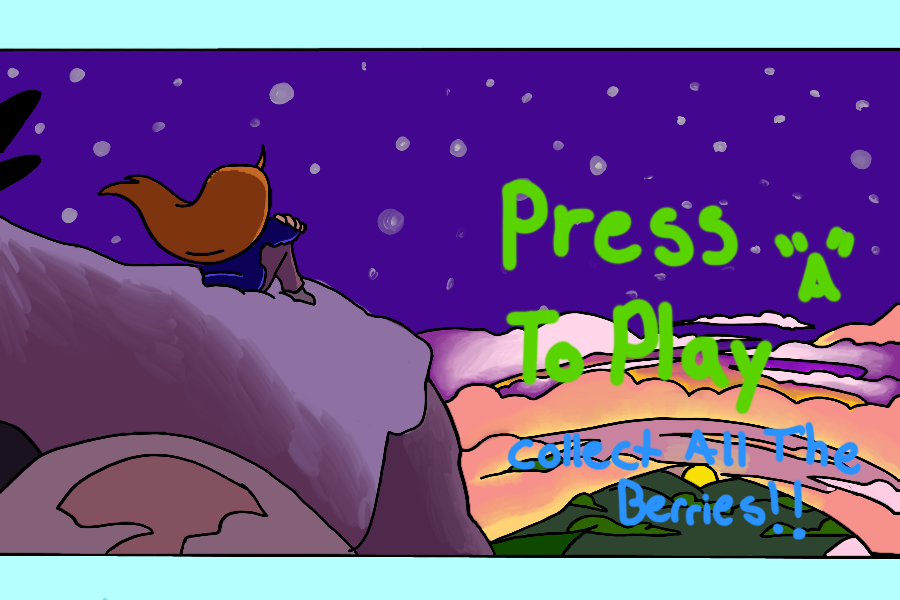

# PROYECTO FINAL 
# Celeste Type Game

# Controles:
 Moverte : Left key and Right key  
 Salto : Space Key  
 Grab to wall : Z Key  
 Pause : P Key
 
# Raylib:

raylib es una biblioteca de programación para disfrutar de la programación de videojuegos; sin interfaz elegante, sin ayudantes visuales, sin herramientas de interfaz gráfica de usuario o editores.  

# Building and running Celeste Game locally

1. Descarga la carpeta .zip proporcionada en este repositorio
2. Debe tener instalado clion para poder hacer uso de este proyetco  
    'https://www.jetbrains.com/es-es/clion/download/#section=windows'
3. Raylib se instalará solo en su proyecto al compilar el programa
4. Habra el proyecto desde Clion
5. Borre el archivo 'vcs.xml' de la carpeta .idea para deslinkear el proyecto de un repositorio
6. Compile y corra el programa desde su ordenador